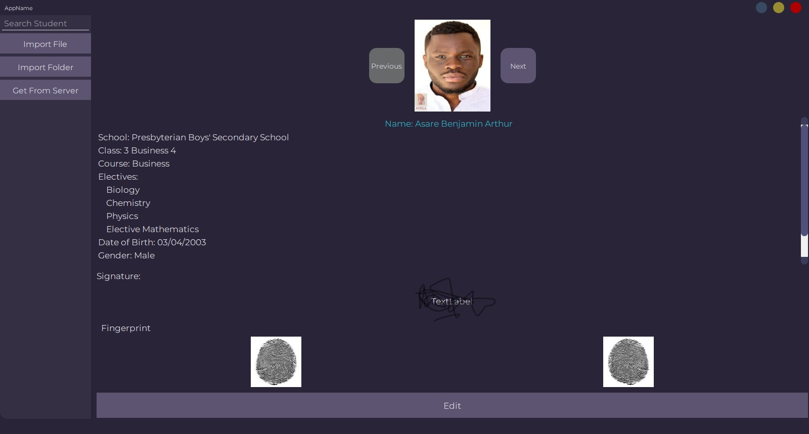

# WASSCEVerse

This is a project built to make registration for WASSCE candidates easier and less time-consuming. This was built primarily with Python, with some parts in HTML, CSS, JavaScript and SCSS.

## The Python App


The app allows the administrator of the school to make changes to students' records.
To run the app, you first need to make sure you have Python 3.10 installed. If you don't you can download Python from [here](https://www.python.org/downloads/release/python-3102/).

Then run:

```batch
pip install -r requirements.txt
```

in your terminal.

## The Website
The website is the open to everyone. It allows all students begin the registration with their respective schools.

### Procedure on the Web